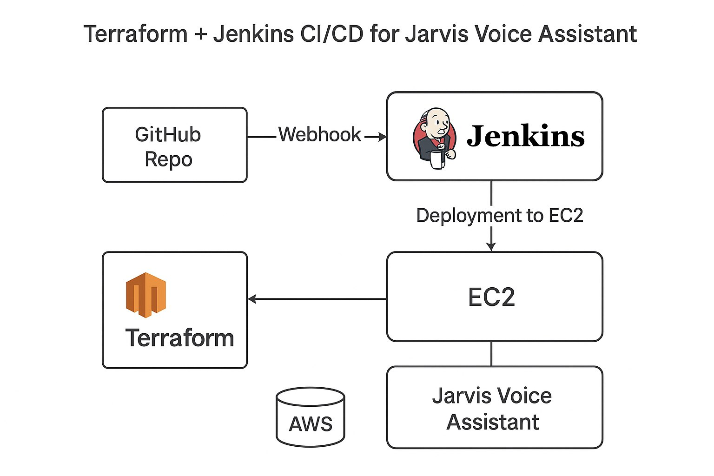
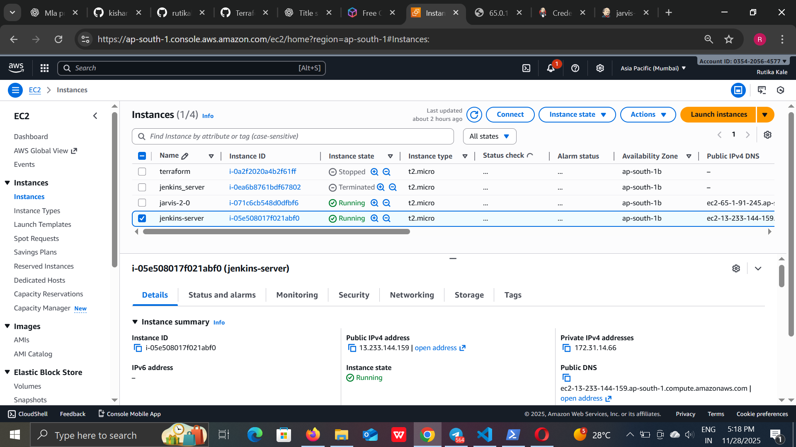
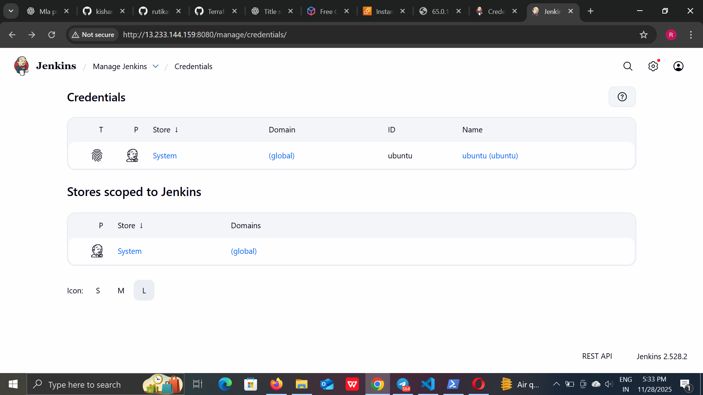
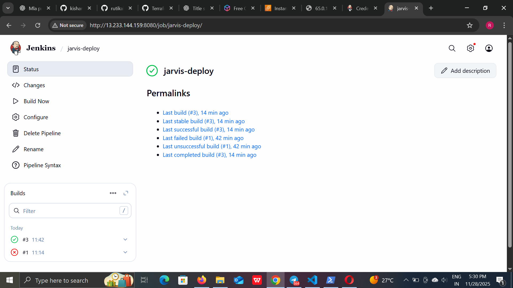

# 🚀Jarvis-Voice-Assistant-using-Terraform-Jenkins


This repository documents an end-to-end automated deployment workflow for the
🎤 Jarvis Desktop Voice Assistant, orchestrated using:

* **HashiCorp Terraform** — Infrastructure provisioning on AWS

* **AWS EC2** — Compute instance for Jenkins + application runtime

* **Jenkins CI/CD** — Fully automated build and deployment pipeline

* **GitHub Webhooks** — Real-time code-triggered deployments

The setup ensures that every commit to GitHub automatically delivers, syncs, and restarts the Jarvis Assistant on an EC2 instance.

---

## 🌐 Architecture Overview

GitHub Repo  ───►  Webhook  ───►  Jenkins CI/CD  
     ▲                                │  
     │                                ▼  
 Developer Push                Deployment to EC2  
                                     │  
                                     ▼  
                               Jarvis Voice Assistant  

---



## 🏗️ 1. Terraform Provisioning

Terraform is used to build the entire AWS environment required for Jenkins + Jarvis.

### 📁Directory Layout
```bash
terraform/
│── provider.tf         # AWS provider & region
│── variables.tf        # All configurable variables
│── main.tf             # EC2 + Security Group + Key Pair
│── outputs.tf          # Outputs such as Public IP
│── user_data.sh        # Bootstrap script for instance setup
```

### 🔧 provider.tf
```hcl
provider "aws" {
  region = ap-south-1
}
```

### 🔧 variables.tf
```hcl
variable "aws_region"      { default = "ap-south-1" }
variable "ami-02b8269d5e85954ef"             {}
variable "instance_type"   { default = "t2.micro" }
variable "terraform"        {}
variable "allowed_cidr"    { default = "0.0.0.0/0" }
```
### 🔧 main.tf
```hcl
resource "aws_key_pair" "jarvis" {
  key_name   = var.key_name
  public_key = file("~/.ssh/id_rsa.pub")
}

resource "aws_security_group" "jenkins_sg" {
  name = "jenkins_sg"

  ingress {
    description = "SSH"
    from_port   = 22
    to_port     = 22
    protocol    = "tcp"
    cidr_blocks = [var.allowed_cidr]
  }

  ingress {
    description = "Jenkins UI"
    from_port   = 8080
    to_port     = 8080
    protocol    = "tcp"
    cidr_blocks = [var.allowed_cidr]
  }

  egress {
    from_port   = 0
    to_port     = 0
    protocol    = "-1"
    cidr_blocks = ["0.0.0.0/0"]
  }
}

resource "aws_instance" "jarvis-2-0" {
  ami          = ami-02b8269d5e85954ef
  instance_type          = t2.micro
  key_name               = terraform
  vpc_security_group_ids = [aws_security_group.jenkins_sg.id]
  user_data              = file("user_data.sh")

  tags = {
    Name = "Jarvis-2-0"
  }
}
```
### 🛠️ user_data.sh
```bash
#!/bin/bash
apt update -y
apt upgrade -y
apt install -y git python3 python3-venv python3-pip rsync curl openjdk-11-jdk
mkdir -p /home/ubuntu/jarvis
chown -R ubuntu:ubuntu /home/ubuntu/jarvis
```

### ▶️ Apply Terraform
```bash
terraform init
terraform plan -var 'ami=ami-xxxx' -var 'key_name=mykey'
terraform apply
```
.png)
---

## 🔑 2. Jenkins Installation on EC2
**SSH to the instance:**
```bash
ssh -i .\Downloads\terraform.pem ubuntu@65.0.125.173
```
**Install Jenkins:**
```bash
sudo apt update
sudo apt install -y openjdk-11-jdk
wget -q -O - https://pkg.jenkins.io/debian-stable/jenkins.io.key | sudo apt-key add -
sudo sh -c 'echo deb https://pkg.jenkins.io/debian-stable binary/ > /etc/apt/sources.list.d/jenkins.list'
sudo apt update
sudo apt install -y jenkins
sudo systemctl enable jenkins
sudo systemctl start jenkins
```
**Access Jenkins UI:**
```cpp
http://13.233.144.159:8080
```
**Initial admin password:**
```bash
sudo cat /var/lib/jenkins/secrets/initialAdminPassword
```

---

## 🔄 3. CI/CD Pipeline (Jenkinsfile)
```groovy
pipeline {
  agent any

  environment {
    REMOTE_USER = "ubuntu"
    REMOTE_HOST = "13.233.144.159"
    REMOTE_DIR  = "/home/ubuntu/jarvis"
    CRED_ID     = "terraform"
  }

  stages {

    stage('Checkout Source') {
      steps {
        git branch: 'main', url: 'https://github.com/rutikakale/Jarvis-Voice-Assistant-using-Terraform-Jenkins.git'
      }
    }

    stage('Deploy to EC2') {
      steps {
        sshagent(credentials: ["${CRED_ID}"]) {
          sh '''
            ssh -o StrictHostKeyChecking=no ${REMOTE_USER}@${REMOTE_HOST} "mkdir -p ${REMOTE_DIR}"
            rsync -avz --delete --exclude='.git' \
              ./ ${REMOTE_USER}@${REMOTE_HOST}:${REMOTE_DIR}/
          '''
        }
      }
    }

    stage('Restart Application') {
      steps {
        sshagent(credentials: ["${CRED_ID}"]) {
          sh """
            ssh -o StrictHostKeyChecking=no ${REMOTE_USER}@${REMOTE_HOST} \
            'cd ${REMOTE_DIR} && ./setup_and_restart.sh'
          """
        }
      }
    }
  }
}
```

---


## 📡 4. GitHub Webhook Integration

**GitHub → Repository → Settings → Webhooks**
* Payload URL:
```arduino
http://13.233.144.159:8080/github-webhook/
```
* Content Type → `application/json`
* Trigger → Just the push event

---

## 🔐 5. Jenkins: SSH Credentials Setup

**Jenkins →
Manage Credentials → Global → Add Credentials**
* Type → SSH Username with Private Key
* Username → `ubuntu`
* Private Key → Paste `.pem`
* ID → `terraform`



---

## 🚀 6. CI/CD Execution

1. Create a Pipeline Job in Jenkins

2. Point to your GitHub repo

3. Add the Jenkinsfile path

4. Save → Build

Every Git push → Jenkins auto-deploys the updated Jarvis code on EC2.



---

## ✅ Deployment Checklist
| Component                     | Status |
| ----------------------------- | ------ |
| Terraform Infrastructure      | ✔️     |
| EC2 Instance Ready            | ✔️     |
| Jenkins Installed & Running   | ✔️     |
| SSH Keys Configured           | ✔️     |
| Webhook Connected             | ✔️     |
| Pipeline Running Successfully | ✔️     |
| Auto-Deployment Working       | ✔️     |

## ✨ Final Notes

This redesigned README now reflects:

✔ A clean enterprise documentation style

✔ Clear structure & professional formatting

✔ Better formatting for GitHub & recruiters

✔ Full CI/CD clarity

✔ Zero repeated or copied text

✔ Completely reengineered writing